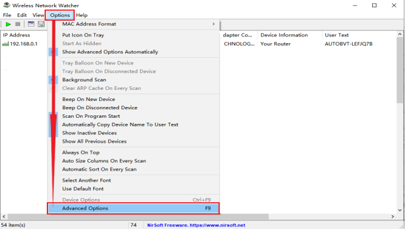
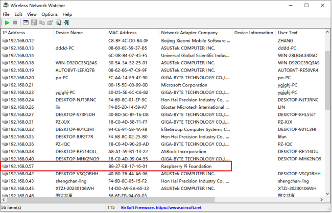
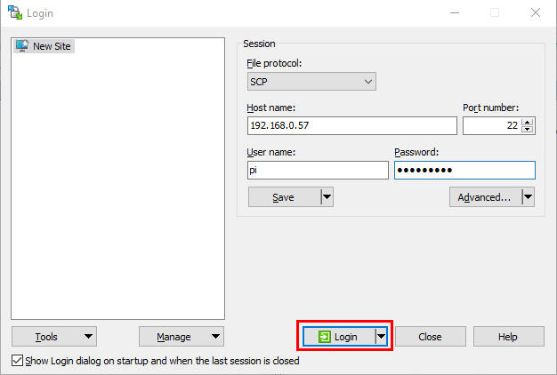
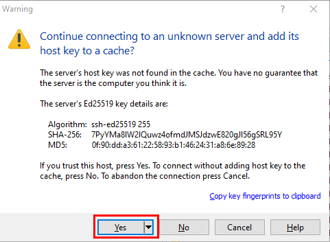
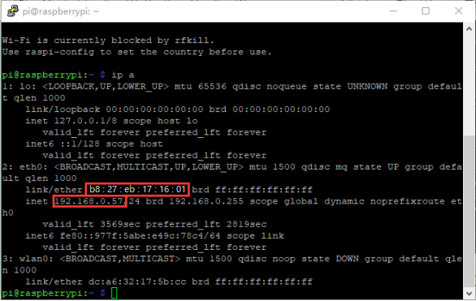
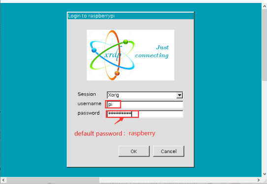
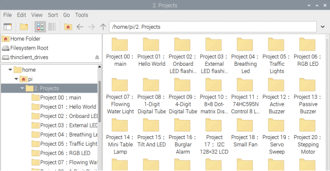
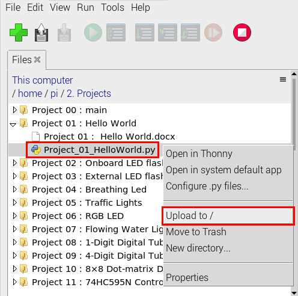
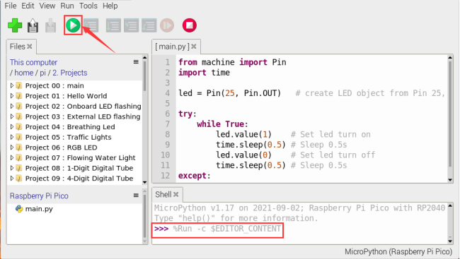

# Preparation

## About Raspberry Pi：

Raspberry Pi is a card computer whose official system is Raspberry Pi OS, which can be installed on other systems, such as: ubuntu, Windows IoT. Raspberry Pi can be used as a personal server, a router, camera monitoring and recognition, as well as voice interaction by connecting a camera and a voice interactive assistant.

Furthermore, Raspberry Pi leads out 40Pin pins that can be connected to various sensors and control LEDs, motors, etc, making it can be used to create a robot.

## Install the Raspberry Pi OS System：

### 1\. Tools needed for the Raspberry Pi system：

#### 1.1. Hardware Tool：

（1）Raspberry Pi 4B/3B/2B （2）Above 16G TFT Memory Card

（3）Card Reader （4）Computer and other parts

#### 1.2. Software tools that need to be installed：

##### Windows System：

###### (1) Install putty

Download link：[<span class="underline">https://www.chiark.greenend.org.uk/\~sgtatham/putty/</span>](https://www.chiark.greenend.org.uk/~sgtatham/putty/)


A.  After downloading the package file , double-click it and tap “Next”.


B.  Click “Next”.


C.  Select“Install Putty files”， and click“Install”。


D.  After a few seconds, the installation is complete, click "Finish".


###### (2) Remote Login software -WinSCP

A. Download link：[<span class="underline">https://winscp.net/eng/download.php</span>](https://winscp.net/eng/download.php)

B. After downloading the WinSCP software file, double-click it then click.


C. Click“Accept”，then select the appropriate option and click“Next”, then click“Install”.


D. After a few seconds, the installation is complete, click "Finish".


###### (3) Format TFT card tool-- SD Card Formatter

A. Download link： [<span class="underline">http://www.canadiancontent.net/tech/download/SD\_Card\_Formatter.html</span>](http://www.canadiancontent.net/tech/download/SD_Card_Formatter.html)


B. Unzip the **SD CardFormatterv5\_WinEN** package and double-click the **SD Card Formatter** file to run it.


C. Click“Next”，select“”and click“Next”.


D. Click “Next”again, and then click “Install”.


E. After a few seconds, the installation is complete, click "Finish".


###### (4) Burn mirror system software tool--- Win32DiskImager

A. Download link：[<span class="underline">https://sourceforge.net/projects/win32diskimager/</span>](https://sourceforge.net/projects/win32diskimager/)


B. After downloading the software file，double-click it and then click“Run”.


C. After selecting，and click“Next”.


D. Click “Browse...”，select the location where Win32DiskImager is installed and click“Next”.


E. Click “Browse...”，select the location where Win32DiskImager is installed and click “Next”.


F. Selectand click“Next”，and then click“Install”.


G. After a few seconds, the installation is complete, click "Finish".


###### (5) Scan for IP address software tool---WNetWatcher

Download Link：http://www.nirsoft.net/utils/wnetwatcher.zip

#### 1.3. Raspberry Pi mirror system

Download link for the latest version：

[<span class="underline">https://www.raspberrypi.org/downloads/raspberry-pi-os/</span>](https://www.raspberrypi.org/downloads/raspberry-pi-os/)

Download link for the old version：

- > Raspbian：

- > <span class="underline">https://downloads.raspberrypi.org/raspbian/images/</span>

- > Raspbian full：

- > <span class="underline">https://downloads.raspberrypi.org/raspbian\_full/images/</span>

- > Raspbian lite：

- > https://downloads.raspberrypi.org/raspbian\_lite/images/

We use the 2020.05.28 version in the tutorial and recommend you to use this version(Please download this version as shown in the picture below.)

<https://downloads.raspberrypi.org/raspios_full_armhf/images/raspios_full_armhf-2021-05-28/>


### 2\. Install Raspberry Pi OS system on Raspberry Pi 4B:

#### 2.1. Connect the TFT memory card to a card reader, then plug the card reader into a computer’s USB port.


#### 2.2. Use the SD Card Formatter to format a TFT memory card, as illustrated below：


#### 2.3. Burn System:

（1）Use **Win32DiskImager** to burn the official **Raspberry Pi OS** mirror to the TFT memory card.


（2）After the mirror system is burned, don’t pull out the card reader, use a notepad to create a file named **SSH** and delete **.txt** , then copy it to the boot directory of the TFT card, so that you can open the SSH login function, as shown in the following figure:


（3） Pull out the card reader.

#### 2.4. Log in system:

（<span style="color: rgb(255, 76, 65);">The following operations require raspberry to share the same LOCAL area network with the PC</span>）

A. Insert the burned TFT memory card into the Raspberry Pi, connect internet cables and plug in power. If there is a screen and a HDMI cable of Raspberry Pi, connect the screen, and you can see the Raspberry Pi OS startup screen. If there is not a HDMI cable of Raspberry Pi, you can enter the desktop of Raspberry Pi via SSH remote login software---WinSCP and xrdp.


B. Use the WNetWatcher software to find the IP address of the Raspberry Pi.


C. If there is no IP address as shown in the figure above, follow the following steps to set it.



D. Once the setup is complete, record the IP and MAC addresses of the Raspberry Pi. As shown in the red box below, the MAC address of the Raspberry Pi is **b8:27:eb:17:16:01**, and the ip address is **192.168.0.57**. 


E. If you do not know the mac address and the ip address of the Raspberry Pi, then unplug the network cable of the Raspberry PI first, open the **WNetWatcher** query, and the detection times will be displayed on the right side of the interface. Connect the Raspberry Pi cable and query it once using **WNetWatcher**, and the Raspberry Pi address is detected one less time than the other addresses. Then write down the ip and mac addresses.

#### 2.5. Remote login

Enter default user name, password and host name on WinSCP to log in. Only a Raspberry Pi is connected in the same network.





#### 2.6. View the ip address and mac address


Click to open terminal and input the password: <span style="color: rgb(255, 76, 65);">raspberry</span>, and tap“**Enter**”on keyboard.


After successfully login, open the terminal, input <span style="color: rgb(255, 76, 65);">ip a</span> and tap“**Enter**”keyboard to view the ip address and mac address.




#### 2.7. Fix the IP address of Raspberry Pi

IP address is changeable, therefore, we need to make IP address fixed for convenient use.

Follow the below steps:

Switch to root user

If without root user’s password

① Set root password

Input password in the terminal: **sudo passwd root** to set password.

② Switch to root user

Input **su root**

③ Fix the configuration file of IP address

Firstly change IP address of the following configuration file.

（<span style="color: rgb(255, 76, 65);">\#New IP address:：address 192.168.0.57</span>）

Copy the above new address to terminal and tap“**Enter**”keyboard.

**Configuration File:**

```
echo -e '

auto eth0

iface eth0 inet static

\#Change IP address

address 192.168.0.57

netmask 255.255.255.0

gateway 192.168.1.1

network 192.168.1.0

broadcast 192.168.1.255

dns-domain 119.29.29.29

dns-nameservers 119.29.29.29

metric 0

mtu 1492

'\>/etc/network/interfaces.d/eth0
```
Example operation diagram, as follows：


④ Reboot the system to activate the configuration file.

Input the restart command in the terminal: **sudo reboot**

You could log in via fixed IP afterwards.

⑤ Check IP to ensure IP address fixed well.


#### 2.8. Log in desktop on Raspberry Pi wirelessly

If we don't have an HDMI cable to connect to the display, can we wirelessly log in to the Raspberry Pi desktop from the Windows desktop? Yes, there are many methods, VNC and Xrdp are commonly used to log in desktop of Raspberry Pi wirelessly.

Let’s take an example of Xrdp.

①Install Xrdp Service in the terminal

Installation commands:

Switch to root User: <span style="color: rgb(255, 76, 65);">su root</span>

Installation commands: <span style="color: rgb(255, 76, 65);">apt-get install xrdp</span>

Enter y and tap“**Enter**”keyboard.

As shown below:


Open the remote desktop connection on Windows

Press **WIN+R** on keyboard and enter **mstsc.exe**.

As shown below:


Enter the IP address of the Raspberry Pi, as shown below. Click “Connect” and then click “Connect”again. **192.168.0.57** is the ip address we use, you could change it into your IP address.


A prompt will appear and you can click“Yes”.


Then enter the user name: <span style="color: rgb(255, 76, 65);">pi</span> ,and the default password: <span style="color: rgb(255, 76, 65);">raspberry</span>, as shown below:



Click“OK”or tap“Enter”keyboard, you will view the desktop of Raspberry Pi OS, as shown below:


Now, we finish the basic configuration of the Raspberry Pi OS system.


## Preparations for Python

Python is a programming language that lets you work more quickly and integrate your systems more effectively.

Python is an interpreted, high-level and general-purpose programming language. Python's design philosophy emphasizes code readability with its notable use of significant whitespace. Its language constructs and object-oriented approach aim to help programmers write clear, logical code for small and large-scale projects.

Next to pick up Python to control 40 pin of Raspberry Pi.

### Hardware：

**Raspberry Pi 4B：**

|                         |                           |
| ----------------------- | ------------------------- |
| **Raspberry Pi 4B**     | **Raspberry Pi 4B Model** |
| |   |

**Hardware Interfaces：**


**40-Pin GPIO Header Description：**

GPIO pins are divided into BCM GPIO number, physics number and WiringPi GPIO number.

We usually use WiringPi GPIO when using C language and BCM GPIO and physics number are used to Python, as shown below;

In these lessons, we use Python, so BCM GPIO number is adopted.


<span style="color: rgb(255, 76, 65);">Note:</span> pin(3.3 V) on the left hand is square, but other pins are round. Turn Raspberry Pi over, there is a square GPIO on the back.(you could tell from pin(3.3V).
 


<span style="color: rgb(255, 76, 65);">Note:</span> the largest current of each pin on Raspberry Pi 4B is 16mA and the aggregate current of all pins is not less than 51mA.

### Copy Example Code Folder to Raspberry Pi：

Place example code folder to the pi folder of Raspberry Pi. and extract the example code from <span style="color: rgb(255, 76, 65);">**Projects.zip**</span> file, as shown below:


Double-click **pythonCode\_A** to check **.py** files.




## Python
    
### Update the firmware of Micropython
    
If you want to run the MicroPython on the Pi Pico board, you need to upload a firmware to the pico board.

You can program via C language or MicroPython on the pico board. But you need to download the MicroPython firmware.

<span style="color: rgb(255, 76, 65);">Note:</span> MicroPython firmware is required to be downloaded once. You don’t need to download it again when programming with MicroPython. If you have downloaded the <span style="color: rgb(255, 76, 65);">.uf2</span> program firmware written in C language, the MicroPython firmware will be overwritten, so next time you use MicroPython, you need to follow the steps below to update the Raspberry Pi Pico's firmware.

### Download the firmward of Micropython

**Method 1:** 
A. Click  to enter the website：[<span class="underline">https://www.raspberrypi.com/documentation/microcontrollers/</span>](https://www.raspberrypi.com/documentation/microcontrollers/)


B. Click“**MicroPython(**Getting started MicroPython**)**”to go to the firmware download page.


**Method 2：** 
Click to open the browser，click [<span class="underline">https://micropython.org/download/rp2-pico/rp2-pico-latest.uf2</span>](https://micropython.org/download/rp2-pico/rp2-pico-latest.uf2) to download the firmware.

<span style="color: rgb(255, 76, 65);">Note：</span>Transfer the firmware（rp2-pico-20210902-v1.17.uf2）to the desktop of Raspberry pi imager

### Program the firmware of MicroPython

Connect a microUSB cable to the USB port of the pico board and computer.

Hold down **BOOTSEL**，and connect a microUSB cable to the USB port of the pico board.


Release the button, then there pops up a page.

Enter raspberry in the Password box, click **OK**.

The drive RPI-RP2 will appear on the desktop of the Raspberry Pi imager

<span style="color: rgb(255, 76, 65);">Note：</span>The latest Raspberry Pi mirroring system will not display the following dialog box, and the old version will display the following dialog box.


Click **OK** and open drive(RPI-RP2). Copy the file（rp2-pico-20210902-v1.17.uf2）to the RPI-RP2.


After the firmware is programmed, the Pico board will reboot. Then you can run Micropython.

### Serial Ports

The MicroPython firmware is equipped with a virtual USB serial port which is accessed through the micro USB connector on Raspberry Pi Pico. Your computer should notice this serial port and list it as a character device, most likely /dev/ttyACM0.

You can run <span style="color: rgb(255, 76, 65);">ls /dev/tty\*</span> to list your serial ports. There may be quite a few, but MicroPython’s USB serial will start with <span style="color: rgb(255, 76, 65);">/dev/ttyACM</span>. If in doubt, unplug the micro USB connector and see which one disappears. If you don’t see anything, you can try rebooting your Raspberry Pi.

Enter the following command to install minicom:

<span style="color: rgb(0, 252, 255);">sudo apt install minicom</span>
<br>
<br>


Select <span style="color: rgb(255, 76, 65);">Y</span> .


Enter the following commander, press **Enter** and open minicom.

<span style="color: rgb(0, 213, 255);">minicom -o -D /dev/ttyACM0</span>
<br>
<br>


Press **Ctrl + B** .


Enter <span style="color: rgb(255, 76, 65);">print("Hello World")</span> at the terminal and press Enter，then Hello World will be displayed.


### Install Thonny

The Raspberry Pi Imager that we downloaded comes with some commonly used software, and Thonny is among them.


If the Raspberry Pi Imager does not have Thonny, you need to manually download it yourself. Enter the following command in the terminal to download and install Thonny.

<span style="color: rgb(0, 213, 255);">sudo apt install thonny</span>
<br>
<br>


Open Thonny, click“**Switch to regular mode**”to switch modes, and click **OK** to reopen the Thonny.


### Connect the Raspberry Pi Pico on the Thonny

Click “**Python3.9.2**”and select“**MicroPython(Raspberry Pi Pico)**”


Click“**Tools**”→“**Options...**”


Select“**Micropython (generic)**”or “**Micropython (Raspberry Pi Pico)**”. How to choose Micropython(Raspberry Pi Pico)? As shown below;


Click“**Port**”to select corresponding “**port**” and click “**OK**”.


Click“**View**”→“**Files**”, then“**This computer**” and “**Raspberry Pi Pico**” will appear.


### Test Code

Test the Shell commander

Enter “**print(Hello World\!)**”in the Shell and press **Enter**” .


#### Online running：

To run Raspberry Pi Pico online, we need to connect the Raspberry Pi Pico to our computer, which allows us to compile or debug programs using Thonny software.  

<span style="color: rgb(255, 76, 65);">Advantages:</span> you can compile or debug programs using Thonny software.


Through the "Shell" window, we can view the error information and output results generated during the operation of the program, and query related function information online to help improve the program.  

<span style="color: rgb(255, 76, 65);">Disadvantages:</span> To run Raspberry Pi Pico online, you must connect Raspberry Pi Pico to a computer and run it with Thonny software.  

If the Raspberry Pi Pico is disconnected from the computer, when they reconnect, the program won't run again.  

[basic](javascript:;) [operation](javascript:;):

Open Thonny and click  “**Open...**”.


Click“**This computer**”.


Enter <span style="color: rgb(255, 76, 65);">home/pi/2.Projects/Project 01: Hello World to select **Project\_01\_HelloWorld.py**</span>, and click “**OK**”.


Click “**Run current script to program Hello World\!.** **Welcome Keyestudio**" will be displayed on the "**Shell**".


#### Exit online

When running online, click “**Stop /Restart Backend**” on Thonny to exit the program.  


#### Offline running code

When running offline, the Raspberry Pi Pico doesn't need to connect to a computer and Thonny.  Once powered up, it can run the <span style="color: rgb(255, 76, 65);">main.py</span> program stored in the Raspberry Pi Pico.  

**Pros**: We don't need to connect a computer to Thonny's software to run the program.  

**Cons**: The program stops automatically when an error occurs or the Raspberry Pi Pico runs out of power, and the code is hard to
change.

[Basic](javascript:;) [Operation](javascript:;):

Once powered up, the Raspberry Pi Pico will  check for the presence of main\.py on the device automatically.  If so, run the program in main\.py and go to the shell command system.  (<span style="color: rgb(255, 76, 65);">If we want the code to run offline, we can save it as main\.py</span>);  If the main\.py does not exist, go directly to the shell command system.  

<!-- end list -->

(1) Click “**File**”→“**New**”, create and write code.


(2) Enter the code in the newly opened file. Here we use the <span style="color: rgb(255, 76, 65);">Project\_02\_Onboard\_LED\_Flashing. Py</span> code as an example.  


(3) Click“**Save**”on the menu bar, we can save the code in This computer or MicroPython device.


<!-- end list -->

(4) Select“<span style="color: rgb(255, 76, 65);">MicroPython device</span>”，enter“<span style="color: rgb(255, 76, 65);">main\.py</span>”in the new pop-up window and click“**OK**”.


(5) Disconnect the microUSB cable to the Raspberry Pi Pico and reconnect, and the LEDs on the Raspberry Pi Pico will  flash repeatedly. 


#### Exit from Offline operation

Connect Raspberry Pi Pico to the computer，click“**Stop/Restart backend**”on Thonny to end the offline operation.  


If it doesn’t work, click“**Stop/Restart backend**”on Thonny several times or reconnect to the Raspberry Pi Pico.


We provide a main\.py file to run offline.  The code added to main\.py is the bootstrap that executes the user code file. We just need to upload the offline project's code file (.py) to the "<span style="color: rgb(255, 76, 65);">MicroPython Device</span>".

Move the folder <span style="color: rgb(255, 76, 65);">**2.Projects**</span> to the folder <span style="color: rgb(255, 76, 65);">**home/pi** of Raspberry Pi system</span> and open Thonny.


② Expand **Project 00 : main** in Disk(D) directory D:\\2. Python Projects. Double-click <span style="color: rgb(255, 76, 65);">**main\.py**</span> to make the code in "<span style="color: rgb(255, 76, 65);">**MicroPython Device**</span>"run offline.  


Here, we use project 00 and Project 02 cases as examples.  The results are displayed using an LED(GP25 pin) on a Raspberry Pi Pico.  If we have modified the Project\_02\_Onboard\_LED\_Flashing. Py file, then we need to modify it accordingly. Right-click the Project\_02\_Onboard\_LED\_Flashing. Py file and select '<span style="color: rgb(255, 76, 65);">**Upload to/**</span>' to upload the code to Raspberry Pi Pico, as shown below.  


Upload the main\.py in the same way.


Disconnect and reconnect the microUSB cable to the Raspberry Pi Pico, and the LEDs will flash repeatedly .


<span style="color: rgb(255, 76, 65);">Note:</span>

The code here runs offline.  If we want to stop running offline and go to "**Shell**", simply click "Stop/Restart Backend" on Thonny software.


### Thonny common operations

#### Upload the code to Raspberry Pi Pico

In the **Project 01：Hello World** file, right-click and select **Project\_01\_HelloWorld.py**，select“<span style="color: rgb(255, 76, 65);">**Upload to /**</span>”and upload the code to the root directory of the Raspberry Pi Pico.



#### Download the code to the computer

In the“**MicroPython device**”, right-click and select **Project\_01\_HelloWorld.py**，select“**Download to ...**”to download the code to our computer.


#### Delete the files in the Raspberry Pi Pico root directory

In the“**MicroPython device**”，right-click and select **Project\_01\_HelloWorld.py**，select“**Delete”**，delete the **Project\_01\_HelloWorld.py** from the Raspberry Pi Pico root directory.


#### Delete files from the computer's directory

In the Project\_01 : Hello World file, right-click and select Project\_01\_HelloWorld.py，select“**Move to Recycle Bin**”，then it can be deleted from the Project\_01\_HelloWorld file.


#### Create and Save Code

①Click“**File**”→“**New**”to create and compile code.


②Enter code in the newly opened file, here we use **Project\_02\_Onboard\_LED\_Flashing.py** code as an example.


③Click“**Save**”，and we can save the code to our computer or the Raspberry Pi Pico.


④ Select“**MicroPython device**”，enter“**main\.py**”in the new pop-up window and click“**OK**”.


⑤ We can see the code has been uploaded to the Raspberry Pi Pico.


⑥Click“**Run current script**”, the LED on the Raspberry Pi Pico will flash periodically.



