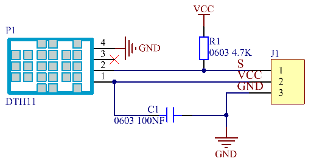

# Project 27：Temperature and Humidity Meter 

## 1. Introduction

In winter, the humidity in the air is very low, that is, the air is very dry. Coupled with the cold, the human skin is prone to crack from excessive dryness. Therefore, you need to use a humidifier to increase the humidity of the air at home. But how do you know that the air is too dry? Then you need equipment to detect air humidity. In this lesson, we will learn how to use the temperature and humidity sensor. We use the sensor to create a thermohygrometer and also combined with an LCD\_128X32\_DOT to display the temperature and humidity values.

## 2. Components Required

<table>
<tbody>
<tr class="odd">
<td></td>
<td></td>
<td></td>
</tr>
<tr class="even">
<td>Raspberry Pi Pico*1</td>
<td>Temperature and Humidity Sensor*1</td>
<td>LCD 128X32 DOT*1</td>
</tr>
<tr class="odd">
<td></td>
<td></td>
<td></td>
</tr>
<tr class="even">
<td>20CM M-F Dupont Wires</td>
<td>10CM M-F Dupont Wires</td>
<td>USB Cable*1</td>
</tr>
</tbody>
</table>

## 3. Component Knowledge


**Temperature and Humidity Sensor:** It is a temperature and humidity composite sensor with calibrated digital signal output. Its accuracy humidity is ±5%RH, temperature is ±2℃. Range humidity is 20 to 90%RH, and temperature is 0 to 50℃. The temperature and humidity sensor applies dedicated digital module acquisition technology and temperature and humidity sensing technology to ensure extremely high reliability and excellent long-term stability of the product. 

The temperature and humidity sensor includes a resistive-type humidity measurement and an NTC temperature measurement component, which is very suitable for temperature and humidity measurement applications where accuracy and real-time performance are not required.

The operating voltage is in the range of 3.3V to 5.5V.

XHT11 has three pins, which are VCC, GND, and S. S is the pin for data output, using serial communication.

**Single bus format definition:**

<table>
<tbody>
<tr class="odd">
<td><strong>Description</strong></td>
<td><strong>Definition</strong></td>
</tr>
<tr class="even">
<td>Start signal</td>
<td>Microprocessor pulls data bus (SDA) down at least 18ms for a period of time(Maximum is 30ms), notifying the sensor to prepare data.</td>
</tr>
<tr class="odd">
<td>Response signal</td>
<td>The sensor pulls the data bus (SDA) low for 83µs, and then pulls up for 87µs to respond to the host's start signal.</td>
</tr>
<tr class="even">
<td>Humidity</td>
<td>The high humidity is an integer part of the humidity data, and the low humidity is a fractional part of the humidity data.</td>
</tr>
<tr class="odd">
<td>Temperature</td>
<td>The high temperature is the integer part of the temperature data, the low temperature is the fractional part of the temperature data. And the low temperature Bit8 is 1, indicating a negative temperature, otherwise, it is a positive temperature.</td>
</tr>
<tr class="even">
<td>Parity bit</td>
<td>Parity bit=Humidity high bit+ Humidity low bit+temperature high bit+temperature low bit</td>
</tr>
</tbody>
</table>

**Data sequence diagram:**

When MCU sends a start signal, XHT11 changes from the low-power-consumption mode to the high-speed mode, waiting for MCU completing the start signal. Once it is completed, XHT11 sends a response signal of 40-bit data and triggers a signal acquisition. The signal is sent as shown in the figure.


Combined with the code, you can understand better.

The XHT11 temperature and humidity sensor can easily add temperature and humidity data to your DIY electronic projects. It is perfect for remote weather stations, home environmental control systems, and farm or garden monitoring systems.

**Specification:**

Working voltage: +5V

Temperature range: 0°C to 50°C, error of ± 2°C

Humidity range: 20% to 90% RH,± 5% RH error

Digital interface

**Schematic diagram:**




## 4. Read the Value


The code used in this project is saved in the file <span style="color: rgb(255, 76, 65);">KS3025 Keyestudio Raspberry Pi Pico Learning Kit Complete Edition\\2. Projects\\Project 27：Temperature Humidity Meter</span>. You can move the code anywhere. We save the code to the pi folder of the Raspberry Pi system. The path: <span style="color: rgb(255, 76, 65);">home/pi/2. Projects</span>.


Open“Thonny”, click“This computer”→“home”→“pi”→“2. Projects”→“Project 27：Temperature Humidity Meter”. Select“dht11\.py”， right-click and select“Upload to /”，waiting for the “dht11\.py”to be uploaded to the Raspberry Pi Pico. And double left-click the“Project\_27.1\_Detect\_Temperature\_Humidity.py”.


```Python
from machine import Pin
import time
import dht11

temperature = 0
humidity = 0
#Initialize temperature and humidity pins and library
dht = dht11.DHT11(22)
time.sleep(0.5)

while True:
    if dht.measure() == 0:
        print("DHT11 data error!")
        break
    time.sleep(1)
    temperature = dht.temperature()
    humidity = dht.humidity()
    print("temperature: %dC  humidity: %d"%(temperature, humidity) + "%")
```

Ensure that the Raspberry Pi Pico is connected to the computer，click“Stop/Restart backend”.


Click “Run current script”, the code starts executing, we will see that the "Shell" window of Thonny IDE will print the temperature and humidity data in the current surroundings, as shown in the following figure. Click“Stop/Restart backend”to exit the program.


## 5. Circuit Diagram and Wiring Diagram

Now we start printing the value of the XHT11 temperature and humidity sensor with LCD screen. We will see the corresponding values on the LCD screen. Let's get started with this project. Please follow the wiring diagram below.

<span style="color: rgb(255, 76, 65);">Note:</span> LCD\_128X32\_DOT must be connected with 10CM M-F Dupont wires, the LCD\_128X32\_DOT will display normally;  Otherwise, using a 20CM M-F Dupont wire may cause the LCD\_128X32\_DOT display abnormally.  


## 6. Test Code

The code used in this project is saved in the file <span style="color: rgb(255, 76, 65);">KS3025 Keyestudio Raspberry Pi Pico Learning Kit Complete Edition\\3. Raspberry Pi System\\Python\_Tutorial\\2. Projects\\Project 27：Temperature Humidity Meter</span>. You can move the code anywhere. We save the code to the pi folder of the Raspberry Pi system. The path: <span style="color: rgb(255, 76, 65);">home/pi/2. Projects</span>.


Open“Thonny”, click“This computer”→“home”→“pi”→“2. Projects”→“Project 27：Temperature Humidity Meter”. Select“dht11\.py”,“lcd128\_32.py”and “lcd128\_32\_fonts.py”，right-click and select“Upload to /”，waiting for the“dht11\.py”，“lcd128\_32.py”and“lcd128\_32\_fonts.py”to be uploaded to the Raspberry Pi Pico. And double left-click the“Project\_27.2\_Temperature\_Humidity\_Meter.py”.


```Python
from machine import Pin, I2C
import time
import lcd128_32_fonts
from lcd128_32 import lcd128_32
import dht11

temp = 0
humi = 0
#Initialize temperature and humidity pins and library
dht = dht11.DHT11(22)
time.sleep(0.5)
#i2c config
clock_pin = 21
data_pin = 20
bus = 0
i2c_addr = 0x3f
use_i2c = True

def scan_for_devices():
    i2c = machine.I2C(bus,sda=machine.Pin(data_pin),scl=machine.Pin(clock_pin))
    devices = i2c.scan()
    if devices:
        for d in devices:
            print(hex(d))
    else:
        print('no i2c devices')

try:
    while True:
        if dht.measure() == 0:
            print("DHT11 data error")
            break
        temp = int(dht.temperature())
        humi = int(dht.humidity())

        if use_i2c:
            scan_for_devices()
            lcd = lcd128_32(data_pin, clock_pin, bus, i2c_addr)
            
        lcd.Clear()
        lcd.Cursor(0, 0)
        lcd.Display("temper:")
        lcd.Cursor(0, 8)
        lcd.Display(str(temp))
        lcd.Cursor(0, 11)
        lcd.Display("C")
        lcd.Cursor(2, 0)
        lcd.Display("Humid:")
        lcd.Cursor(2, 7)
        lcd.Display(str(humi))
        lcd.Cursor(2, 10)
        lcd.Display("%")
        time.sleep(1)
except:
    pass
```

## 7. Test Result
    
Ensure that the Raspberry Pi Pico is connected to the computer，click“Stop/Restart backend”.
    

    
Click “Run current script”, the code starts executing, we will see that the LCD\_128X32\_DOT will display temperature and humidity in the current environment. 
Press“Ctrl+C”or click“Stop/Restart backend”to exit then program.


